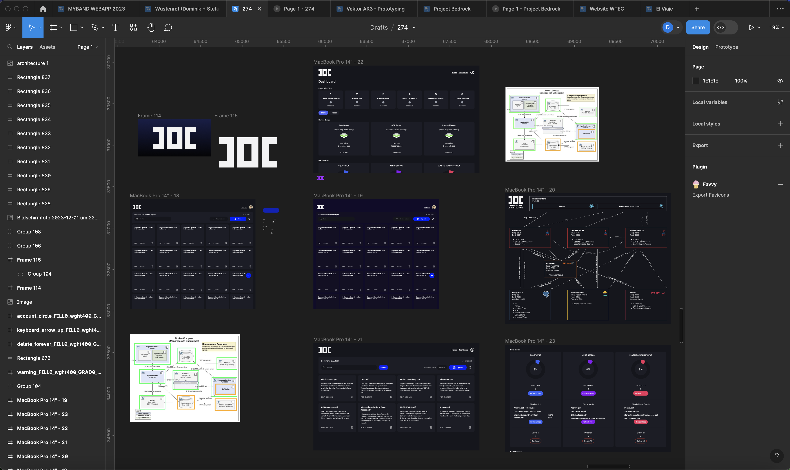
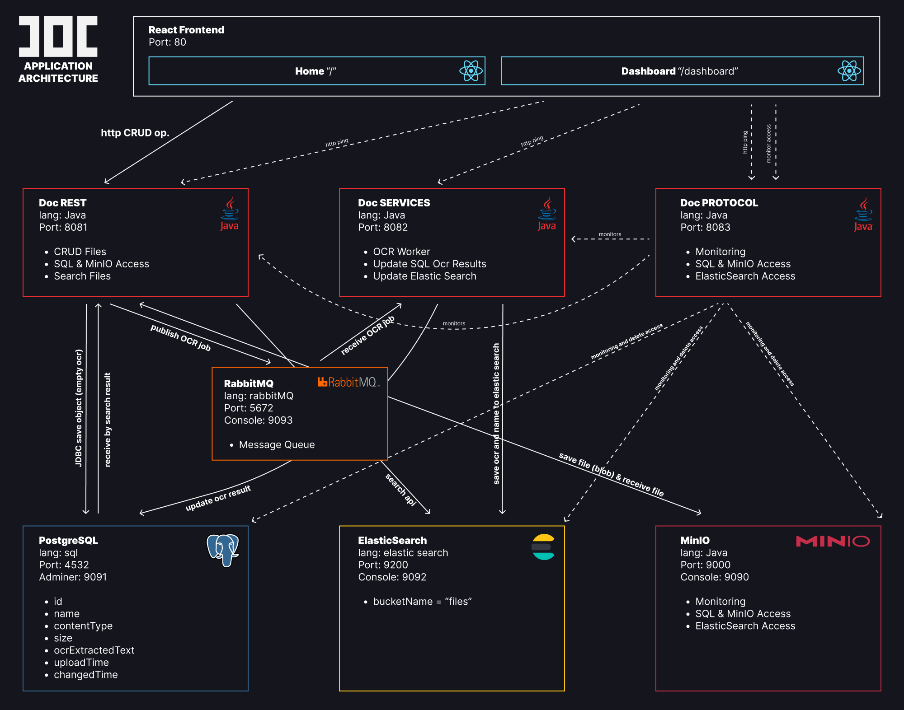
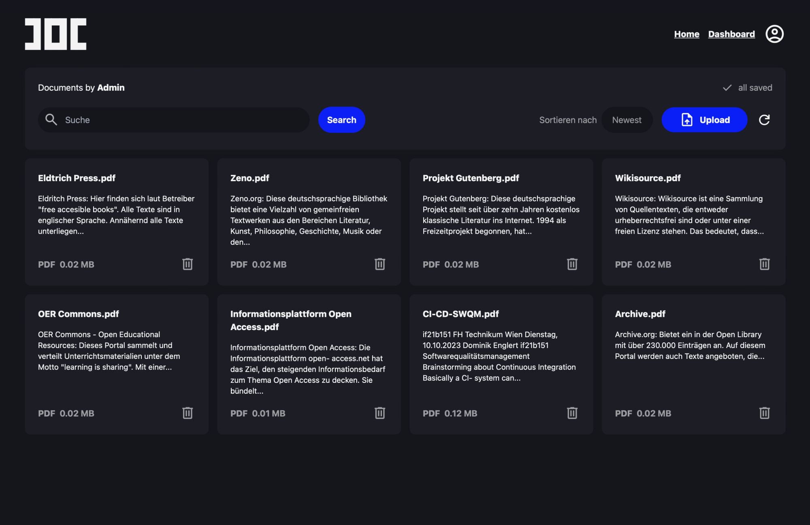
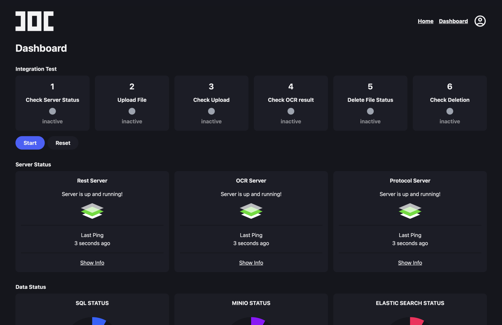
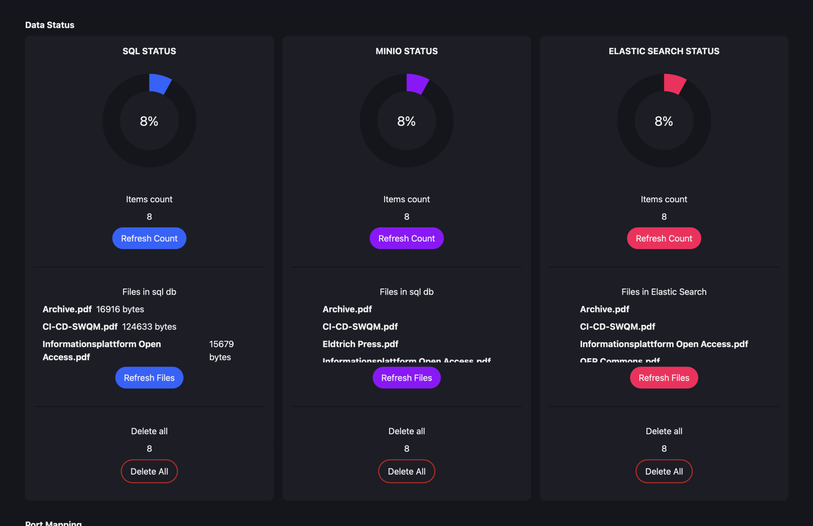

*©Dominik Englert, if21b151, 2023<br>
©Artjom Moisejev, if21b055, 2023<br>
©Viktor Bartosik, if21b082, 2023<br>
<br>
Technikum Wien<br>
Softwarekomponentensysteme (SWKOM)<br>
Markus Holzer<br>
time-spent: ~ 200 h*

# PAPERLESS "DOC" Softwarekomponentensystem
## Protocol
Willkommen bei unserem Paperless System "DOC". Dem wohl beeindruckensten Dokumentenverwaltungssystem aller Zeiten.


## UI /UX Design
Das UI/UX Design für die Web-Applikation erfolgte über Figma. Darauf basierend eine custom Umsetzung in React mit Unterstützung von TailwindCSS. 



## Server Architektur
Die folgende Grafik zeigt den recht komplexen Aufbau von DOC. Im Zentrum stehen drei Java-Server, sowie ein React Frontend. 



### Doc REST
Der Doc REST Server übernimmt sämtliche Aufgaben bezogen auf File Upload, Löschen, Updaten (CRUD Operations). 

### Doc SERVICE
Der Doc SERVICE Server enthält einen OCR Worker mittels Tesseract für PNG, JPG, JPEG Dateien, sowie PDFBox für Pdf-Dateien. Andere Datei-Formate werden nicht unterstützt. Pdfs mit Bild-Content werden vom OCR Worker nicht richtig erfasst.

### Doc PROTOCOL
Doc PROTOCOL stellt in einem POC einen Server zum Monitoring, sowie zur Kontroller der 2 Hauptserver dar. Seine Funktionen umfassen unteranderem momentane Daten einzulesen, sowie alle Datenbanken zu löschen. Theoretisch denkbar wären deutlich weitreichendere Funktionalitäten, wie z.B. automatisch integrierte Test.

### RabbitMQ
Als Message Broker liegt der Applikation RabbitMQ zugrunde. In dieser Architektur übernimmt er vor allem das Erfassen von neuen Uploads im Doc REST und der damit folgenden Nachricht an Doc SERVICES zum Start der OCR Worker.

### Daten
Der Applikation liegen 3 Datenbanken zugrunde. Einmal eine PostgreSQL Datenbank zum Speichern der Files nach angegebenen Schema, ElasticSearch zur Indexierung der Ergebnisse der OCR Worker für Suchfunktionalität, sowie MinIO zum speichern der File-Daten selbst als BLOB. Alle drei Speicher agieren unabhängig von einander und werden von den jeweiligen Repositories bzw. Services angesprochen.

### Frontend


Das React Frontend ist ebenso wie sämtliche Server von Grund auf neu entwickelt um allen Anforderungen gerecht zu werden. Als CSS Framework kommt TailwindCSS zum Einsatz. Die Vorgestaltung erfolgte in Figma.

### Frontend Dashboard



Über das eigens entwickelte Dashboard (zu erreichen unter localhost:80/dashboard) erhält man Einsicht in die aktuellen Stati der Server, sowie einen allgemeinen Überblick über die Speicherstände der Datenbanken. Darüber hinaus bietet das Dashboard die Möglichkeit einen Integration Test vom Frontend aus zu starten. Dieses durchläuft die wichtigsten Schritte der Applikationen und kontrolliert diese jeweils auf ihre richtige Durchführung. Sämtliche dadurch entstandenen Änderungen werden am Ende des Tests rückgängig gemacht.

### Ordner Struktur

- /root (paperless_swkom_2023)
    - docker-compose.yml
    - start-env-linux.sh
    - start-env-mac.sh
    - README.md
    - DocPROTOCOL
        - Java Server: PROTOCOL
    - DocREST
        - Java Server: REST
    - DocSERVICES
        - Java Server: SERVICES
    - DocUI
        - React App: UI
    - src_readme
        - images for readme
    - minio_storage
        - files (= bucket)


## Einrichtung & Start
Zum Start der einzelnen Micro-Services liegen sowohl ein docker-compose.yml file, als auch ein shell script bereit. Wichtig: In jedem Fall ist es ratsam zu warten bis alle Services zuverlässig gestartet sind - davor könnten einige Service über die Ports noch nicht erreichbar sein.

**1. Vor dem Start: Docker Daemon starten**

**2. Vor dem Start: Im Root Verzeichnis Ordner "minio_storage" erstellen (falls nicht vorhanden) & in diesem Ordner einen Ordner "files" erstellen** 
-- Ziel: root/minio_storage/files -> vorhanden.

**3. Server Builden:**
1. Im folder /DocREST: ``` mvn clean install -DskipTests ```
2. Im folder /DocSERVICES: ``` mvn clean install -DskipTests ```
3. Im folder /DocPROTOCOL: ``` mvn clean install -DskipTests ```

Kontrolle: In jedem folder sollte nun ein /target folder erstellt worden sein und darin ein File namens: SERVER_NAME-0.0.1-SNAPSHOT.jar 
(SERVER_NAME = DocRest / DocPROTOCOL / DocSERVICES)
Sollte dieses File anders benannt sein ggfs. umbennen.

### Start Shell
Im Root folder: 

MAC: ``` sh start-env-mac.sh ```

LINUX: ```sh start-env-linux.sh ```

WINDOWS: ``` Kauf dir einen Mac oder Linux ```

Anmerkung: Das Shell-Skript ist nur auf Mac-OS getestet und braucht ggfs. Anpassungen je nach Linux Distribution.

### Manual Start Docker-Compose
Im Root folder: 

``` docker-compose up --build ```

Wichtig: --build muss mit angegeben werden, da einige images erst noch gebuilded werden müssen. 
Sobald alle Services im Docker gestartet sind (das kann dauern), können die einzelnen Service über localhost:PORT erreicht werden. 
Die wichtigsten sind: 

Service  | Port
------------- | -------------
DocUI  | 80
DocUI Dashboard | 80/dashboard
MinIO Console | 9090
Postgres Adminer | 9091 (defekt)
RabbitMQ | 9093
ElasticSearch | 9092


## Known Issues

### Funktionalität
- Docker images start schlägt manchmal fehl für die Java Server, da diese abhängig von den anderen Services sind. Einige health-checks wurden im compose file bereits implementiert, könnten jedoch umfassender und genauer sein
- OCR: Tesseract X PdfBox: Aktuell werden image files (png, jpg, jpeg) von Tesseract verarbeitet, PDFs von PdfBox. Das funktioniert für PDFs nur so lange diese auch als Text im PDF hinterlegt sind (Bilder in PDFs werden ignoriert). Tesseract selbst funktioniert - jedoch nur gut mit Computer-Schrift -> Handschrift Erkennung ist schlecht. Sprachensupport nur englisch aktuell. -> Erweiterung denkbar.

### Unit Tests
In Summe sind 55 Unit Tests hinterlegt, wobei diese jetzt im angepassten Environment alle fehl schlagen, da sie auf eine andere Entwicklungsumgebung angewiesen sind, bzw. auf das Starten der anderen Services (z.B. Repository Test an Datenbank). 

Wichtig wäre hier eine klare Trennung zwischen dem Repository hier - in welchem die Services auf einander angewiesen sind und einer klaren Entwicklugnsumgebung, in welcher die Services getrennt und unabhängig laufen können.

### Good (here: bad) Practice
- DASHBOARD: Aktuell teils direkt Zugriffe auf z.B. Datenbanken / Teils Zugriff über PROTOCOL Server (welcher selbst ebenso failen könnte usw.)
- Unit Tests umfassend, aber nicht allumfassend - besser vollständig alles testen
- automatisierte Tests (auch beim Build) (werden aktuell ignoriert beim build, da Fehler durch Abhängigkeiten von anderen Services entstehen im Docker Environment)
- SearchService im REST Server kümmert sich auch um Löschen von Daten -> hier bzgl. wording eine bessere Trennung von Datenmanagement in ElasticSearch und Such-Zugriffen
- Access & Passwort Management -> wird hier einfach plain hochgeladen, im ernstfall natürlich verschlüsselt privat übertragen und persönlich einbetten in Code o.ä.

### Nice To Have
- Umfassendere und besser gegliederte Monitoring Funktionalität über Dashboard
- PDF to img conversion (wenn kein text in pdfs) und dann OCR mit Tesseract